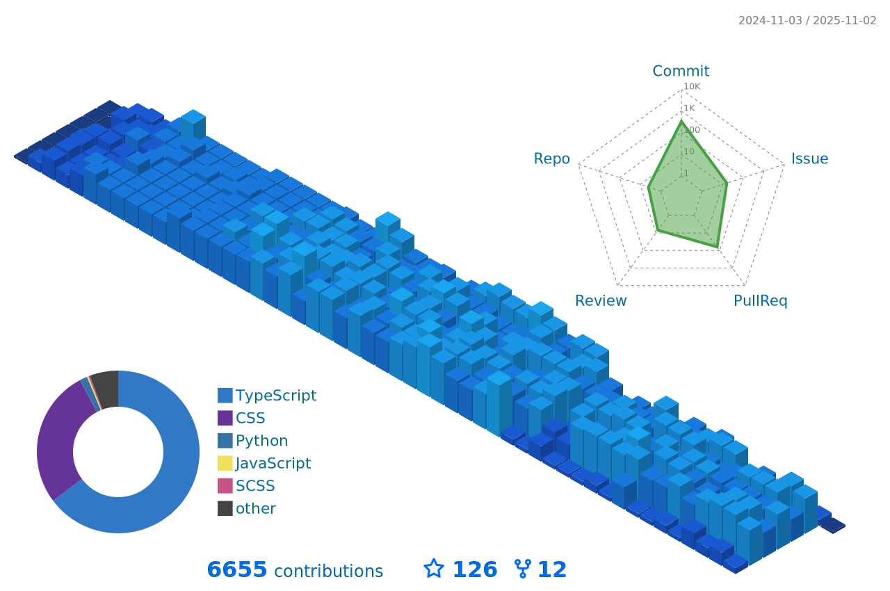

  

 

<h1>Open Source Makes Your Life Better</h1>

 

  <picture>
    <source srcset="https://raw.githubusercontent.com/odest/odest/refs/heads/master/images/logo-dark.gif" media="(prefers-color-scheme: light)">
    <source srcset="https://raw.githubusercontent.com/odest/odest/refs/heads/master/images/logo-light.gif" media="(prefers-color-scheme: dark)">
    
  </picture>

 

  

 

&nbsp;

  

 

<h2>Stats</h2>

 

   

  
  
  

